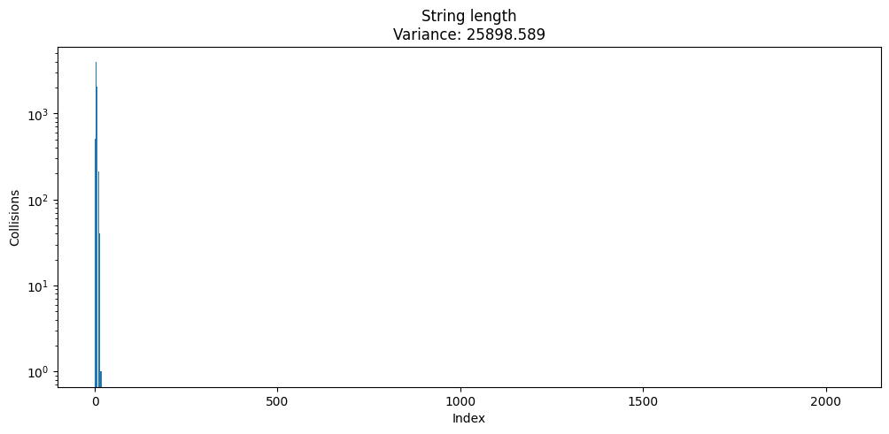
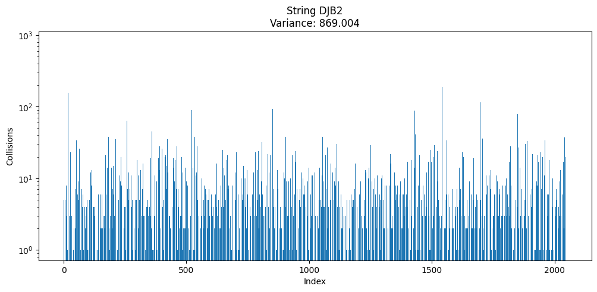

# Работа по оптимизации работы хеш-таблицы

## Оглавление

- [Цели работы](#цели-работы)
- [Теория](#теория)
- [Оборудование](#оборудование)
- [Постановка задачи](#постановка-задачи)
- [Разработка базовой версии](#разработка-базовой-версии)
- [Ассемблерная оптимизация](#ассемблерная-оптимизация)
- [Оптимизиация inline ассемблером](#оптимизиация-inline-ассемблером)
- [Оптимизиция интринсиками](#оптимизиция-интринсиками)
- [Вывод](#вывод)
- [Список литературы](#список-литературы)

## Цели работы

- Изучить работу хеш-таблицы
- Сравнить работу разных хеш-функций
- Оптимизировать работу операций хеш-таблицы

--- 

## Теория

### Хеш-функция
**Хеш-функция** — алгоритм, преобразующий данные произвольной длины в уникальную строку фиксированного размера (хеш).  
**Основные свойства**:
- Одинаковые входные данные → одинаковый хеш.
- Нельзя восстановить исходные данные из хеша.
- Даже минимальное изменение данных кардинально меняет хеш.

Пример:  
`хеш("meow") = a3f5...`  
`хеш("Meow") = 7c9d...` (регистр влияет на результат).

---

### Хеш-таблица
**Хеш-таблица** — структура данных для эффективного хранения пар **ключ-значение**.  
**Принцип работы**:
1. Ключ преобразуется в индекс массива: `индекс = хеш(ключ) % размер_таблицы`.
2. Значение сохраняется в ячейке с этим индексом.
   
**Операции**:  
- Добавление: O(1) в среднем.
- Поиск: O(1) в среднем.
- Удаление: O(1) в среднем.

---

### Коллизии и методы их разрешения
**Коллизия** — ситуация, когда разные ключи получают одинаковый индекс.
**Основные методы**:

1. **Метод цепочек**  
   Каждая ячейка содержит список пар. При коллизии элементы добавляются в этот список.  
   *Пример визуализации*:  
     
   *Пояснение*: На рисунке показано, как несколько пар с разными ключами, но одинаковым индексом, хранятся в виде цепочки (списка) внутри одной ячейки.

2. **Открытая адресация**  
   Все пары хранятся в самом массиве. Если ячейка с вычисленным индексом занята, алгоритм ищет следующую свободную ячейку по определённому правилу:
   - **Линейное пробирование**: последовательный перебор ячеек.
   - **Квадратичное пробирование**: шаг увеличивается квадратично.
   - **Двойное хеширование**: используется вторая хеш-функция.

3. **Идеальное хеширование**  
   Специальный метод, при котором коллизии **полностью исключаются**.  
   **Условия**:
   - Набор ключей должен быть статичен (известен заранее).
   - Используется двухуровневая схема: глобальная хеш-функция распределяет ключи по группам, а для каждой группы подбирается своя хеш-функция без коллизий.

### Дополнительные определения

**Ассемблерная вставка** — фрагмент кода на языке ассемблера, встроенный в программу на высокоуровневом языке (в нашем случае C). 
Зачем используется:
- Для оптимизации узких участков кода.
- Прямого доступа к возможностям процессора.

**Векторные инструкции** — набор команд процессора, позволяющих выполнять одну операцию над несколькими данными одновременно (SIMD - single instruction, multiple data).

**Интринсики** — специальные функции или макросы, предоставляемые компилятором для доступа к векторным инструкциям напрямую из кода на C/C++.
Преимущества:
- Упрощают использование SIMD-инструкций без написания кода на ассемблере.
- Обеспечивают переносимость между разными компиляторами.

**Профилирование** — процесс анализа производительности программы для выявления "узких мест" (bottlenecks). Включает:
- Замер времени выполнения функций
- Анализ использования ресурсов (CPU, память, кэш)
- Построение тепловых карт и графов вызовов
Примеры:
- `perf` — сбор низкоуровневых метрик (кэш-промахи, инструкции за цикл)
- `hyperfine` — статистический замер времени выполнения
- `Valgrind` — анализ утечек памяти


## Оборудование

### Аппаратное и программное обеспечение
В ходе тестирования использовалась следующая конфигурация:

---

#### Аппаратная часть
| **Компонент**           | **Характеристики**                       |
|-------------------------|------------------------------------------|
| Процессор (CPU)         | AMD Ryzen 7 5700U (8 ядер, 16 потоков)   |
| Базовая частота         | 1.8 GHz (максимальная до 4.3 GHz)        |
| Средняя частота в тестах| ~4.3 GHz                                 |
| Температура             | ~80 °C (под нагрузкой)                   |
| Архитектура             | x86_64 (Zen 2)                           |
| Доступные SIMD          | AVX2 и SSE4                              |


#### Программная часть
| **Компонент**           | **Версия/Настройки**                     |
|-------------------------|------------------------------------------|
| ОС                      | Arch Linux (ядро 6.13.8-arch1-1)         |
| Компилятор              | GCC 14.2.1                               |
| Мониторинг              | `htop` (частота, температура CPU)        |
| Профилирование          | `perf` и `hyperfine`                     |

Тесты запускались без припрепления программы к определённому ядру.

#### Тестовые данные

Файл `big_file.txt` - содержит примерно 40 тысяч уникальных слов и всего состоит из 10 миллионов слов. Данный файл есть объединение разных произведений, которые можно найти в папке `books`, повторенное 4 раза. Затем для тестирования поиска берутся случайные слова из этого же файла 10 миллионов раз. 


## Постановка задачи 
Целью работы является создание и оптимизация хеш-таблицы с методом цепочек для подсчёта уникальных английских слов.  
**Основные задачи**:  
1. Разработка базовой версии с:
   - Вставкой ключей  
   - Поиском ключей   
   - Удалением ключей  
2. Анализ и оптимизация производительности:
   - Подбор оптимальной хеш-функции  
   - Сравнение эффекта от флагов компиляции (без флагов, `-O0`, `-O2`, `-O3`)
   - Профилирование, используя `perf` и `hyperfine`
   - Внедрение трёх низкоуровневых оптимизаций, используя: ассемблер, inline ассемблер и интринсики  

---

### Математическое обоснование  
Для оценки качества хеш-функции используется **дисперсия длины цепочек**:

$$
\sigma^2 = \frac{1}{N} \sum_{i=1}^{N} (l_i - \bar{l})^2
$$

где:  
- $$N$$ — количество цепочек в хеш-таблице,  
- $$l_i$$ — длина цепочки в $$i$$-й ячейке,  
- $$\bar{l} = \frac{1}{N} \sum_{i=1}^{N} l_i$$ — средняя длина цепочки.  

**Критерий оптимальности**: минимальная дисперсия → равномерное распределение ключей.

**Ускорение** после оптимизиаций считается по формуле:
$$S = T_{before} / T_{after}$$

- $$S$$ - коэффициент ускорения
- $$T_{before}$$​ - время выполнения до оптимизации
- $$T_{after}$$​ - время выполнения после оптимизации

Если $$S > 1$$, то оптимизация дала ускорение, если $$S < 1$$, то производительность ухудшилась. Чем выше этот коэффициент, тем лучше.

## Разработка базовой версии

### Сравнение хеш-функций для строк

Тестирование проводилось на **20 тысяч случайных английских слов** из файла `big_file.txt` с размером хеш-таблицы **2048**.

#### Результаты тестирования

| **Метод**            | **Дисперсия**  | График распределения                         |
|----------------------|----------------|----------------------------------------------|
| **Длина строки**     |                |        |
| **Сумма символов**   | 289 175.4      |           |
| **Полиномиальный**   | 943.8          |  |
| **CRC32**            | 1 012.5        |         |
| **djb2**             | ~850–900       |           |
| **fnv-1a**           | ~800–850       |          |
| **sdbm**             |                |           |

---

### Вывод

Выделим методы по итогу тестирования, которыми будем пользоваться. Лучше всего себя показали хеш-фукнции: 


### Структура данных хеш-таблицы

Для удобной и быстрой работы, будем загружать весь текст в массив, а затем получать слова, как указатель на начало слова и его длина.

```C++
typedef struct HashTable
{
    List*  buckets; // цепочки
    size_t capacity; // Вместимость хеш-таблицы
    size_t length; // Нынешнее количество цепочек в таблице
} HashTable;

// Структура цепочки

typedef struct Node
{
    int next;
    int prev;
} Node;

typedef struct NodeData
{
    const char* key_pointer;
    int length;
    int count;
} NodeData;

typedef struct List
{
    Node*     node_array;
    NodeData* data;
    
    int free_node;
    size_t capacity;
    size_t size;
} List;

```

### Анализ производительности базовой версии с разными флагами

| Флаги компиляции    | Построение таблицы   | Построение + поиск   |
|---------------------|----------------------|----------------------|
| **Без флагов**      | `740.3 мс ± 7.7 мс`  | `2.872 с ±  0.034 с` |
| `-O0`               | `739.6 мс ± 5.0 мс`  | `2.865 с ±  0.011 с` |
| `-O2`               | `605.0 мс ± 4.7 мс`  | `2.546 с ±  0.044 с` |
| `-O3`               | `607.0 мс ± 4.7 мс`  | `2.535 с ±  0.008 с` |

Будем считать изначальное время выполнение равным, как при работе с флагом `-O2`.

## Ассемблерная оптимизация

Сначала попробуем оптимизировать построение хеш-таблицы. Используем `perf`.


Видим, что функция по добавлению элемента `listIncrementValue` занимает много тактов. Попробуем ее оптимизировать. Для этого напишем свой `memcmp` (стандартная функция сравнения блоков памяти). Идея в том, чтобы попробовать сравнивать по два/четыре/восемь символов за раз. Пример такой функции:

```asm
myMemcmp:
.loop_4_bytes:
    cmp rdx, 4
    jb .reminder
    mov eax, [rsi]
    mov ecx, [rdi]
    cmp eax, ecx
    jne .not_equal
    add rsi, 4
    add rdi, 4
    sub rdx, 4
    jmp .loop_4_bytes
...
```

Применим её в нашем коде и сделаем новые сравнения.

| **Этап оптимизации**      | **Время построения**   | **Ускорение (S)**     |  
|---------------------------|------------------------|-----------------------|  
| Базовая реализация -O2    | `605.0 мс ± 4.7 мс`    | 1.00×                 |
| Ассемблер (2 символа)     | `603.6 мс ± 10.8 мс`   | 1.00×                 |
| Ассемблер (4 символа)     | `576.8 мс ± 4.7 мс`    | 1.05× (лучшая версия) |  
| Ассемблер (8 символа)     | `586.1 мс ± 5.9 мс`    | 1.03×                 |

Теперь попробуем применить векторные инструкции, учитывая, что длина слов будет не больше, чем 32 символа. Для этого будем сравнивать одновременно 32 символа с помощью иструкций AVX2, а лишнее отсекать. Новый код:

```asm
myMemcmp:
    mov ecx, edx       
    mov eax, 1
    shl eax, cl       
    dec eax          

    vmovdqu ymm0, [rdi]
    vmovdqu ymm1, [rsi]
    vpcmpeqb ymm2, ymm0, ymm1
    vpmovмсkb edx, ymm2 

    and edx, eax
    cmp edx, eax
    sete al
    movzx eax, al
    ret
```

| **Этап оптимизации построения**      | **Время построения**   | **Ускорение (S)** |  
|--------------------------------------|------------------------|-------------------|  
| Базовая реализация -O2               | `605.0 мс ± 4.7 мс`    | 1.00×             |
| Ассемблер                            | `576.8 мс ± 4.7 мс`    | 1.05×             |
| Ассемблер + SIMD                     | `587.8 мс ± 13.0 мс`   | 1.03×             | 

Видим, что в данном случае использование векторных инструкций не помогло. А лучше всего сработала версия, которая сравнивает сначала
по 4 символа за раз, а затем остаток от нуля до трёх символов.

## Оптимизиация inline ассемблером

Также фукнция `memcmp` присутствует при получении значения. Сделаем замеры, используя уже написанную нами функцию сравнения слов. А также 
снова применим идею с векторизацией, однако в этот раз сделаем все inline.

```C++
    for (size_t i = 1; i <= size; i++) 
    {
        NodeData* node_data = node_data_array + i;
        if (node_data->length != length)
        {
            continue; 
        }

        uint32_t bitmask, mask;

        mask = (1U << length) - 1;

        __asm__ __volatile__ (
                "vmovdqu ymm0, [%[a]]\n"      
                "vmovdqu ymm1, [%[b]]\n"      
                "vpcmpeqb ymm2, ymm0, ymm1\n" 
                "vpmovмсkb %[bm], ymm2\n"    
                : [bm] "=a" (bitmask)           
                : [a] "r" (key),                
                  [b] "r" (node_data->key_pointer)
                : "ymm0", "ymm1", "ymm2"       
                );

        if ((bitmask & mask) == mask) 
        {
            return node_data->count;
        }
    }
```

Результаты учитывая применённые раннее оптимизации:

| **Этап оптимизации**                 | **Время поиска**       | **Ускорение (S)** |  
|--------------------------------------|------------------------|-------------------|  
| Базовая реализация -O2               | `2.546 с ±  0.044 с`   | 1.00×             |
| Ассемблер memcmp                     | `2.515 c ±  0.023 c`   | 1.01×             |
| Inline ассемблер + SIMD              | `2.447 c ±  0.010 c`   | 1.04×             | 

В данном случае подход с SIMD инструкциями дал больший прирост в производительности, чем написанная функция memcmp. Так что оставляем вариант с инлайн ассемблером и векторными инструкциями.

## Оптимизиция интринсиками

Данные в `perf` после применных оптимизиаций:

Теперь оптимизируем функцию хеширования. На данный момент она выглядит так:

```C++
static uint32_t hashFunction(const char* str, size_t len, size_t size)
{
    assert(str != NULL);

    const char* i = NULL;
    int j;
    uint32_t byte = 0, crc = 0, mask = 0;
    static uint32_t crc32_table[256] = {0};

    if (crc32_table[1] == 0)
    {
        for (byte = 0; byte <= 255; byte++)
        {
            crc = byte;
            for (j = 7; j >= 0; j--)
            {
                mask = -(crc & 1);
                crc = (crc >> 1) ^ (0xEDB88320 & mask);
            }
            crc32_table[byte] = crc;
        }
    }

    crc = 0xFFFFFFFF;
    for (i = str; i < str + len; ++i)
    {
        uint8_t ch = (uint8_t)*i; 
        crc = (crc >> 8) ^ crc32_table[(crc ^ ch) & 0xFF];
    }

    return (~crc) % size;
}
```

Код взят со стороннего ресурса.

Однако в наборе команд SSE4 присутствует интринсик `_mm_crc32_u8`, который считает crc32 хеш. Новый код:
```C++
static uint32_t hashFunction(const char* str, size_t len, size_t size)
{
    assert(str != NULL);

    uint32_t crc = 0xFFFFFFFF;
    for (size_t i = 0; i < len; i++) 
    {
        crc = _mm_crc32_u8(crc, str[i]);
    }
    return (~crc) % size;
}
```

Также можно заметить, что в ассемблерном коде используется
команда `div` (деление), которая занимает много времени, в силу сложности данной операции. Пусть количество цепочек в таблице будет всегда степенью двойки, тогда остаток можно брать, используя побитовый `and` (Пример: 101 & 001 → 001). В нашем случае

```C++
return (~crc) & (size - 1); // вместо (~crc) % size;
```

Сделаем снова замеры учитывая прошлые оптимизации. Для построения:

| **Этап оптимизации**                 | **Время построения**   | **Ускорение (S)** |  
|--------------------------------------|------------------------|-------------------|  
| Базовая реализация -O2               | `605.0 мс ± 4.7 мс`    | 1.00×             |
| CRC32 SSE4                           | `536.9 мс ± 4.9 мс`    | 1.12×             |
| CRC32 SSE4 + AND                     | `515.0 мс ± 3.8 мс`    | 1.17×             |

С поиском:

| **Этап оптимизации**                 | **Время поиска**       | **Ускорение (S)** |  
|--------------------------------------|------------------------|-------------------|  
| Базовая реализация -O2               | `2.546 с ±  0.044 с`   | 1.00×             |
| CRC32 SSE4                           | `2.380 с ±  0.013 с`   | 1.07×             |
| CRC32 SSE4 + AND                     | `2.352 с ±  0.008 с`   | 1.08×             |

## Вывод

Приведём таблицу итоговых оптимизаций

| Флаги компиляции    | Построение таблицы   | Построение + поиск   |
|---------------------|----------------------|----------------------|
| **Без флагов**      | `740.3 мс ± 7.7 мс`  | `2.872 с ±  0.034 с` |
| `-O2`               | `605.0 мс ± 4.7 мс`  | `2.546 с ±  0.044 с` |
| Три оптимизации     | `515.0 мс ± 3.8 мс`  | `2.352 с ±  0.008 с` |


## Список литературы

