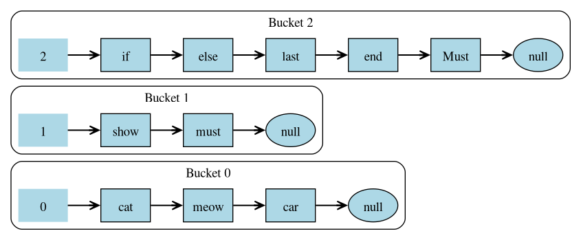
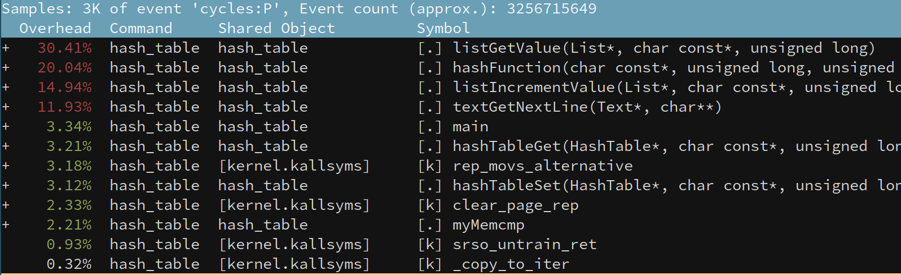

# Работа по оптимизации работы хеш-таблицы

## Оглавление

- [Цель работы](#цель-работы)
- [Теория](#теория)
- [Оборудование](#оборудование)
- [Постановка задачи](#постановка-задачи)
- [Разработка базовой версии](#разработка-базовой-версии)
- [Ассемблерная оптимизация](#ассемблерная-оптимизация)
- [Оптимизиация inline ассемблером](#оптимизиация-inline-ассемблером)
- [Оптимизиция интринсиками](#оптимизиция-интринсиками)
- [Вывод](#вывод)
- [Список литературы](#список-литературы)

## Цель работы

- Изучить работу хеш-таблицы
- Сравнить работу разных хеш-функций
- Оптимизировать работу операций хеш-таблицы

## Теория

### Хеш-функция
**Хеш-функция** — алгоритм, преобразующий данные произвольной длины в уникальное число фиксированного размера (хеш).
Свойства хорошей хеш-функции:
- Быстрое вычисление.
- Низкое число коллизий (определение коллизий дано ниже).

**Коллизия** — ситуация, когда разные ключи получают одинаковый индекс.

Пример:
`хеш("meow") = a3f5...`
`хеш("Meow") = 7c9d...` (регистр влияет на результат).

### Хеш-таблица
**Хеш-таблица** — структура данных для эффективного хранения пар **ключ-значение**.
**Принцип работы**:
1. Ключ преобразуется в индекс массива: `индекс = хеш(ключ) % размер_таблицы`.
2. Значение сохраняется в ячейке с этим индексом.

**Операции**:
- Добавление: O(1) в среднем.
- Поиск: O(1) в среднем.
- Удаление: O(1) в среднем.

### Коллизии и методы их разрешения
**Основные методы**:

1. **Метод цепочек**
   Каждая ячейка содержит список пар. При коллизии элементы добавляются в этот список.
   *Визуализация*:
   
   *Пояснение*: На рисунке показано, как несколько пар с разными ключами, но одинаковым индексом, хранятся в виде цепочки (списка) внутри одной ячейки.

2. **Открытая адресация**
   Все пары хранятся в самом массиве. Если ячейка с вычисленным индексом занята, алгоритм ищет следующую свободную ячейку по определённому правилу:
   - **Линейное пробирование**: последовательный перебор ячеек.
   - **Квадратичное пробирование**: шаг увеличивается квадратично.
   - **Двойное хеширование**: используется вторая хеш-функция.

3. **Идеальное хеширование**
   Специальный метод, при котором коллизии **полностью исключаются**.
   **Условия**:
   - Набор ключей должен быть статичен (известен заранее).
   - Используется двухуровневая схема: глобальная хеш-функция распределяет ключи по группам, а для каждой группы подбирается своя хеш-функция без коллизий.

### Дополнительные определения

**Ассемблерная вставка** — фрагмент кода на языке ассемблера, встроенный в программу на высокоуровневом языке (в нашем случае C).
Зачем используется:
- Для оптимизации узких участков кода.
- Прямого доступа к возможностям процессора.

**Векторные инструкции** — команды процессора, позволяющих выполнять одну операцию над набором данных одновременно (SIMD - single instruction, multiple data).

**Интринсики** — это специальные обёртки над ассемблерными инструкциями.
Преимущества:
- Упрощают использование SIMD-инструкций без написания кода на ассемблере.
- Обеспечивают переносимость между разными компиляторами.

**Профилирование** — процесс анализа производительности программы для выявления "узких мест" (bottlenecks). Включает:
- Замер времени выполнения функций
- Анализ использования ресурсов (CPU, память, кэш)
- Построение тепловых карт и графов вызовов
Примеры программ:
- `perf` — сбор низкоуровневых метрик (кэш-промахи, инструкции за цикл)
- `hyperfine` — статистический замер времени выполнения
- `Valgrind` — анализ выделенной памяти

### Математическое обоснование
Для оценки качества хеш-функции используется **дисперсия длины цепочек**:

$$
\sigma^2 = \frac{1}{N} \sum_{i=1}^{N} (l_i - \bar{l})^2
$$

где:
- $N$ — количество цепочек в хеш-таблице,
- $l_i$ — длина цепочки в $$i$$-й ячейке,
- $\bar{l} = \frac{1}{N} \sum_{i=1}^{N} l_i$ — средняя длина цепочки.

**Критерий оптимальности**: минимальная дисперсия → равномерное распределение ключей.

**Ускорение** после оптимизиаций считается по формуле:
$$S = T_{before} / T_{after}$$

- $S$ - коэффициент ускорения
- $T_{before}$​ - время выполнения до оптимизации
- $T_{after}$​ - время выполнения после оптимизации

Если $S > 1$, то оптимизация дала ускорение, если $S < 1$, то производительность ухудшилась. Чем выше этот коэффициент, тем лучше.


## Оборудование

### Аппаратное и программное обеспечение
В ходе тестирования и сбора метрик использовалась следующая конфигурация:

#### Аппаратная часть
| **Компонент**                     | **Характеристики**                       |
|-----------------------------------|------------------------------------------|
| Процессор (CPU)                   | AMD Ryzen 7 5700U (8 ядер, 16 потоков)   |
| Средняя частота в тестах          | ~4.3 GHz                                 |
| Температура во время тестирования | ~80 °C                                   |
| Архитектура                       | x86_64 (Zen 2)                           |
| Доступные векторные расширения    | AVX2 и SSE4                              |


#### Программная часть
| **Компонент**           | **Версия/Настройки**                     |
|-------------------------|------------------------------------------|
| ОС                      | Arch Linux (ядро 6.13.8-arch1-1)         |
| Компилятор              | GCC 14.2.1                               |
| Версия glibc            | (GNU libc) 2.41                          |
| Мониторинг              | `htop` (частота, температура CPU)        |
| Профилирование          | `perf` и `hyperfine`                     |

Тесты запускались c прикрепления программы к ядру 1, а также выставлением наибольшего приоритета. Для стабилизации частоты и температуры использовались разогревочные запуски программы.
Программа запускалась командой в терминале: `hyperfine 'taskset -c 1 nice -20 ./build/hash_table' --warmup 50 --runs 50`

#### Тестовые данные

Файл `big_file.txt` - содержит приблизительно 40 тысяч уникальных слов и всего состоит из 10 миллионов слов. Данный файл есть объединение разных литературных произведений, которые можно найти в папке `books`, повторённые 4 раза. Затем для тестирования поиска берутся случайные слова из этого же файла 10 миллионов раз.

## Постановка задачи
Целью работы является создание и оптимизация хеш-таблицы с методом цепочек для подсчёта уникальных английских слов.
**Основные задачи**:
1. Разработка базовой версии с:
   - Вставкой ключей
   - Поиском ключей
   - Удалением ключей
2. Анализ и оптимизация производительности:
   - Подбор оптимальной хеш-функции
   - Сравнение эффекта от флагов компиляции (без флагов, `-O0`, `-O2`, `-O3`)
   - Профилирование, используя `perf` и `hyperfine`
   - Внедрение трёх низкоуровневых оптимизаций, используя: ассемблер, inline ассемблер и интринсики


## Разработка базовой версии

### Сравнение хеш-функций для строк

Тестирование проводилось на **20 тысяч случайных английских слов** из файла `big_file.txt` с размером хеш-таблицы **2048**.

#### Результаты тестирования

| **Метод**            | **Дисперсия**  | График распределения                         |
|----------------------|----------------|----------------------------------------------|
| **Длина строки**     | 25898.6        |        |
| **Сумма символов**   | 1074.0         |           |
| **Полиномиальный**   | 820.7          |  |
| **CRC32**            | 834.2          |         |
| **djb2**             | 869.0          |           |
| **fnv-1a**           | 1058.3         |          |
| **sdbm**             | 837.1          |           |

Выделим метод по итогу тестирования, которым будем пользоваться. Лучше всего себя показали хеш-фукнции: полиномиальный, crc32, sdbm. Для исследований была выбрана **crc32**, так как можно увидеть меньшее количество длинных цепочек и из-за дальнейшей возможности векторизовать вычисления.


### Структура данных хеш-таблицы

Для удобной и быстрой работы, будем загружать весь текст в массив, а затем получать слова, как указатель на начало слова и его длина.

```C++
typedef struct HashTable
{
    List*  buckets;  // цепочки
    size_t capacity; // Вместимость хеш-таблицы
    size_t length;   // Нынешнее количество цепочек в таблице
} HashTable;

// Структура цепочки

typedef struct Node
{
    int next;
    int prev;
} Node;

typedef struct NodeData
{
    const char* key_pointer;
    int length;
    int count;
} NodeData;

typedef struct List
{
    Node*     node_array; // связи в связном списке
    NodeData* data;       // данные в списке

    int    free_node;
    size_t capacity;
    size_t size;
} List;

```

### Анализ производительности базовой версии с разными флагами

| Флаги компиляции    | Построение таблицы   | Построение + поиск   |
|---------------------|----------------------|----------------------|
| **Без флагов**      | `962.3 мс ± 21.2 мс` | `2.053 с ±  0.013 с` |
| `-O0`               | `962.0 мс ± 9.6 мс`  | `2.054 с ±  0.026 с` |
| `-O2`               | `466.9 мс ± 5.6 мс`  | `1.087 с ±  0.016 с` |
| `-O3`               | `476.6 мс ± 6.4 мс`  | `1.081 с ±  0.011 с` |

Таблица ускорения:

| **Флаги компиляции**     | **Построение таблицы** | **Построение + поиск**   |
|--------------------------|------------------------|--------------------------|
| **Без флагов**           | 1.00x                  | 1.00x                    |
| -O0                      | 1.00x                  | 1.00x                    |
| -O2                      | 2.06x                  | 1.88x                    |
| -O3                      | 2.02x                  | 1.90x                    |

## Ассемблерная оптимизация

Сначала попробуем оптимизировать построение хеш-таблицы. Используем `perf`.


Видим, что функция по добавлению элемента `listIncrementValue` занимает много тактов. Попробуем ее оптимизировать. Для этого напишем свой `memcmp` (стандартная функция сравнения блоков памяти). Идея в том, чтобы попробовать сравнивать по два/четыре/восемь символов за раз. Пример такой функции:

```asm
myMemcmp:
.loop_4_bytes:
    cmp rdx, 4
    jb .reminder
    mov eax, [rsi]
    mov ecx, [rdi]
    cmp eax, ecx
    jne .not_equal
    add rsi, 4
    add rdi, 4
    sub rdx, 4
    jmp .loop_4_bytes
...
```

Применим её в нашем коде и сделаем новые сравнения.

| **Этап оптимизации**      | **Время построения**   | **Ускорение (S)**     |
|---------------------------|------------------------|-----------------------|
| Базовая реализация -O2    | `466.9 мс ± 5.6 мс`    | 1.00×                 |
| Ассемблер (2 символа)     | `446.6 мс ± 5.2 мс`    | 1.04×                 |
| Ассемблер (4 символа)     | `440.0 мс ± 4.7 мс`    | 1.05× (лучшая версия) |
| Ассемблер (8 символа)     | `449.1 мс ± 7.2 мс`    | 1.03×                 |

Теперь попробуем применить векторные инструкции, учитывая, что длина слов будет не больше, чем 32 символа. Для этого будем сравнивать одновременно 32 символа с помощью иструкций AVX2, а лишнее отсекать. Новый код:

```asm
myMemcmp:
    mov ecx, edx
    mov eax, 1
    shl eax, cl
    dec eax

    vmovdqu ymm0, [rdi]
    vmovdqu ymm1, [rsi]
    vpcmpeqb ymm2, ymm0, ymm1
    vpmovмсkb edx, ymm2

    and edx, eax
    cmp edx, eax
    sete al
    movzx eax, al
    ret
```

| **Этап оптимизации построения**      | **Время построения**   | **Ускорение (S)**     |
|--------------------------------------|------------------------|-----------------------|
| Базовая реализация -O2               | `466.9 мс ± 5.6 мс`    | 1.00×                 |
| Ассемблер (4 символа)                | `440.0 мс ± 4.7 мс`    | 1.05× (лучшая версия) |
| Ассемблер + SIMD                     | `433.4 мс ± 5.7 мс`    | 1.07×                 |

Видим, что в данном случае использование векторных инструкций помогло. Оставим эту версию

## Оптимизиация inline ассемблером

Также фукнция `memcmp` присутствует при получении значения. Сделаем замеры, используя уже написанную нами функцию сравнения слов. А также
снова применим идею с векторизацией, однако в этот раз сделаем все inline.

```C++
    for (size_t i = 1; i <= size; i++)
    {
        NodeData* node_data = node_data_array + i;
        if (node_data->length != length)
        {
            continue;
        }

        uint32_t bitmask, mask;

        mask = (1U << length) - 1;

        __asm__ __volatile__ (
                "vmovdqu ymm0, [%[a]]\n"
                "vmovdqu ymm1, [%[b]]\n"
                "vpcmpeqb ymm2, ymm0, ymm1\n"
                "vpmovмсkb %[bm], ymm2\n"
                : [bm] "=a" (bitmask)
                : [a] "r" (key),
                  [b] "r" (node_data->key_pointer)
                : "ymm0", "ymm1", "ymm2"
                );

        if ((bitmask & mask) == mask)
        {
            return node_data->count;
        }
    }
```

Результаты учитывая применённые раннее оптимизации:

| **Этап оптимизации**                 | **Время поиска**       | **Ускорение (S)** |
|--------------------------------------|------------------------|-------------------|
| Базовая реализация -O2               | `1.087 с ±  0.016 с`   | 1.00×             |
| Ассемблер memcmp                     | `1.033 c ±  0.010 c`   | 1.05×             |
| Inline ассемблер + SIMD              | `0.998 c ±  0.014 c`   | 1.08×             |

В данном случае подход лучше сработала версия с инлайн ассемблером, чем написанная функция memcmp, так как не происходит накладных расходов на вызовов функции. Так что оставляем вариант с инлайн ассемблером и векторными инструкциями.


## Оптимизиция интринсиками

Данные в `perf` после применных оптимизиаций:


Теперь оптимизируем функцию хеширования. На данный момент она выглядит так:

```C++
static uint32_t hashFunction(const char* str, size_t len, size_t size)
{
    assert(str != NULL);

    const char* i = NULL;
    int j;
    uint32_t byte = 0, crc = 0, mask = 0;
    static uint32_t crc32_table[256] = {0};

    if (crc32_table[1] == 0)
    {
        for (byte = 0; byte <= 255; byte++)
        {
            crc = byte;
            for (j = 7; j >= 0; j--)
            {
                mask = -(crc & 1);
                crc = (crc >> 1) ^ (0xEDB88320 & mask);
            }
            crc32_table[byte] = crc;
        }
    }

    crc = 0xFFFFFFFF;
    for (i = str; i < str + len; ++i)
    {
        uint8_t ch = (uint8_t)*i;
        crc = (crc >> 8) ^ crc32_table[(crc ^ ch) & 0xFF];
    }

    return (~crc) % size;
}
```

Однако в наборе команд SSE4 присутствует интринсик `_mm_crc32_u8`, который считает crc32 хеш. Новый код:

```C++
static uint32_t hashFunction(const char* str, size_t len, size_t size)
{
    assert(str != NULL);

    uint32_t crc = 0xFFFFFFFF;
    for (size_t i = 0; i < len; i++)
    {
        crc = _mm_crc32_u8(crc, str[i]);
    }
    return (~crc) % size;
}
```

Также можно заметить, что в ассемблерном коде используется
команда `div` (деление), которая занимает много времени, в силу сложности данной операции.


Пусть количество цепочек в таблице будет всегда степенью двойки, тогда остаток можно брать, используя побитовый `and` (Пример: 101 & 001 → 001). В нашем случае

```C++
return (~crc) & (size - 1); // вместо (~crc) % size;
```

Сделаем снова замеры учитывая прошлые оптимизации. Для построения:

| **Этап оптимизации**                 | **Время построения**   | **Ускорение (S)**    |
|--------------------------------------|------------------------|----------------------|
| `-O2`                                | `466.9 мс ± 5.6 мс`    | 1.00x                |
| CRC32 SSE4                           | `400.6 мс ± 8.0 мс`    | 1.16×                |
| CRC32 SSE4 + AND                     | `379.4 мс ± 7.5 мс`    | 1.22×                |

Для поиска:

| **Этап оптимизации**                 | **Время поиска**       | **Ускорение (S)** |
|--------------------------------------|------------------------|-------------------|
| `-O2`                                | `1.087 с ±  0.016 с`   | 1.00×             |
| CRC32 SSE4                           | `0.938 с ±  0.012 с`   | 1.15×             |
| CRC32 SSE4 + AND                     | `0.891 с ±  0.010 с`   | 1.21×             |

## Вывод

Приведём таблицу итоговых оптимизаций

| **Флаги компиляции**     | **Построение таблицы**   | **Построение + поиск**   |
|--------------------------|--------------------------|--------------------------|
| Без флагов               | `962.3 мс ± 21.2 мс`     | `2.053 с ±  0.013 с`     |
| -O2                      | `466.0 мс ± 5.6 мс`      | `1.087 с ±  0.016 с`     |
| Свой memcmp              | `433.4 мс ± 5.7 мс`      | `1.054 c ±  0.012 с`     |
| Inline memcmp + SIMD     | `433.4 мс ± 5.7 мс`      | `0.998 c ±  0.014 c`     |
| Crc32 SSE4 + быстрый DIV | `379.4 мс ± 7.5 мс`      | `0.891 с ±  0.010 с`     |

Таблица с ускорением относительно компиляции без флагов:
| **Флаги компиляции**     | **Построение таблицы** | **Построение + поиск**   |
|--------------------------|------------------------|--------------------------|
| Без флагов               | 1.00x                  | 1.00x                    |
| Свой memcmp              | 2.22x                  | 1.94x                    |
| Inline memcmp + SIMD     | 2.22x                  | 2.05x                    |
| Crc32 SSE4 + быстрый DIV | 2.53x                  | 2.30x                    |

И таблица с ускорением относительно компиляции с флагом -O2:

| **Флаги компиляции**     | **Построение таблицы** | **Построение + поиск**   |
|--------------------------|------------------------|--------------------------|
| -O2                      | 1.00x                  | 1.00x                    |
| Свой memcmp              | 1.07x                  | 1.03x                    |
| Inline memcmp + SIMD     | 1.07x                  | 1.08x                    |
| Crc32 SSE4 + быстрый DIV | 1.22x                  | 1.21x                    |

В итоге получили ускорение для построения на `22%` и `21%` для построения и поиска соответственно относительно компиляции с флагом -O2.

## Список литературы

1. **Bryant, R. E., & O'Hallaron, D. R.** Computer Systems: A Programmer's Perspective (3rd ed.).

2. **Intel Corporation.** Intel® Intrinsics Guide [Электронный ресурс]. URL:
   [https://www.laruence.com/sse/](https://www.laruence.com/sse/) (зеркало оригинального руководства)

3. **Хеш-таблица** // Вики-конспекты ИТМО [Электронный ресурс]. URL:
   [https://neerc.ifmo.ru/wiki/index.php?title=Хеш-таблица](https://neerc.ifmo.ru/wiki/index.php?title=Хеш-таблица)
